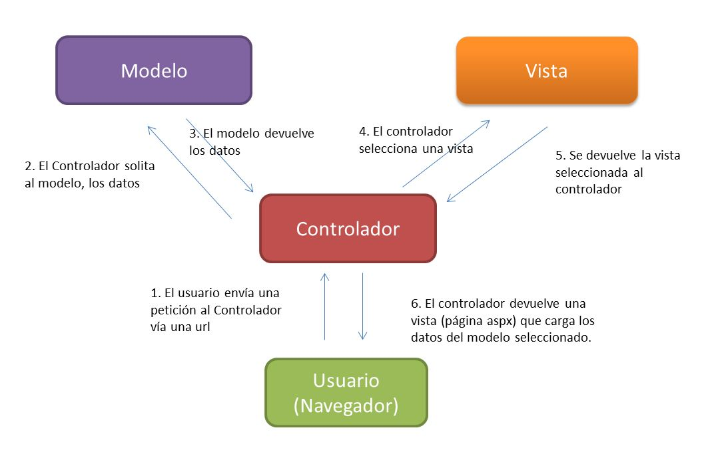

<b>Modelo-Vista-Controlador</b>

DBAX se basa en el patrón de desarrollo del Modelo-Vista-Controlador. MVC es un enfoque de software que separa la lógica de aplicación de la presentación. En la práctica, permite que las vistas solo tengan código de presentación y que la logica de negocio se produzca en los modelos y controladores.

**El modelo** representa las estructuras de datos. Normalmente los precedimientos y funciones del modelo contendrán las operaciones que le ayudan a recuperar, insertar y actualizar la información en su modelo de datos.

**La vista** es la información que se presenta a un usuario. Una vista normalmente será una página web, pero en DBAX, una vista también puede ser un fragmento de la página como un encabezado o pie de página. 

**El controlador** actúa como un intermediario entre el Modelo, la Vista, y todos los demás recursos necesarios para procesar la petición HTTP y generar una página web.

DBAX tiene un enfoque poco restrictivo con MVC ya que ni los controladores ni los modelos son imperativos. Si no necesitas separar los elementos de código, para simplificar el mantenimiento de los modelos, puede ignorar, por ejemplo, los modelos y generar la aplicación solo con el uso de controladores y vistas. 